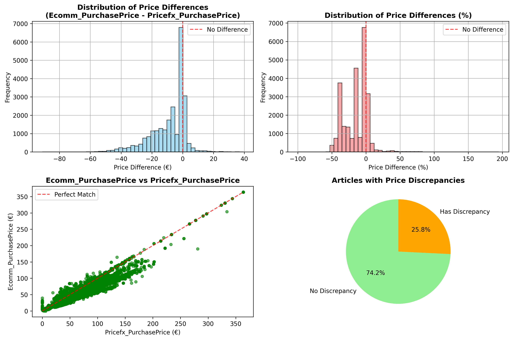
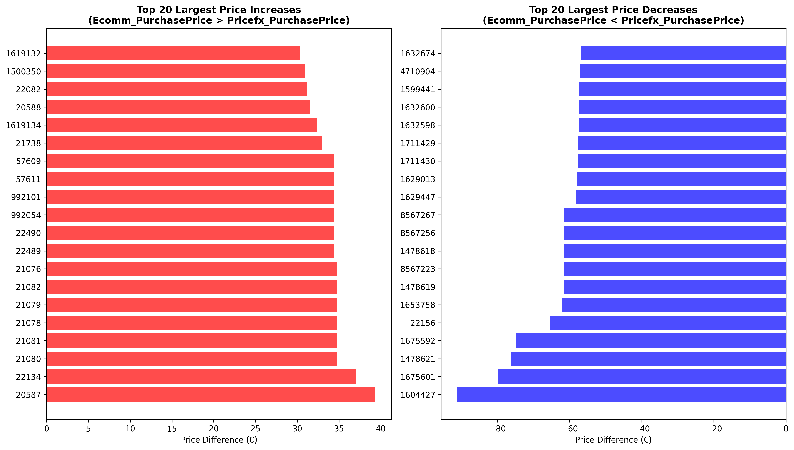

# Purchase Price Analysis Summary

This document summarizes the comprehensive purchase price analysis performed on multiple data sources, including the initial consolidation and the critical comparison with master product data.

## 1. Initial Data Consolidation

### Data Sources
The analysis began with two Excel sheets from `purchase_price.xlsx`:
- **Tabelle1**: Recent purchase prices (1,889 articles → 1,867 after duplicate removal)
- **Bestand Odoo**: Historical purchase prices (25,077 articles)

### Duplicate Resolution
- **Articles with Duplicates Found**: 22 articles in Tabelle1
- **Duplicates with Price Differences**: 3 articles had different prices
- **Resolution Strategy**: Kept only the **lowest price** for each duplicate article
- **Cost Impact**: Achieved savings by retaining optimal pricing

### Final Consolidated Dataset
- **Total Articles**: 25,155 unique articles
- **Common Articles**: 1,789 articles present in both sheets
- **Output File**: `data/final_purchase_price.csv`

## 2. Master Data Comparison Analysis

### Overview
The consolidated purchase price list was compared against the master product data from `PurchasePriceCost-2025-09-09T15-41-13.xlsx` to identify discrepancies and data quality issues.

### Data Coverage
- **Consolidated Articles**: 25,155
- **Master Data Articles**: 293,305
- **Common Articles Found**: 24,537 (97.5% coverage)
- **Missing from Master Data**: 618 articles (2.5%)

### Price Discrepancy Analysis
- **Articles with Price Differences**: 18,212 out of 24,537 (74.2%)
- **Average Price Difference**: €-8.56 (Ecomm_PurchasePrice lower than Pricefx_PurchasePrice)
- **Median Price Difference**: €-5.76
- **Standard Deviation**: €11.87
- **Price Range**: -€91.16 to +€39.31

## 3. Key Findings

### 📊 **Data Quality Metrics**
- **High Coverage**: 97.5% of consolidated articles found in master data
- **Significant Discrepancies**: 74.2% of articles have price differences
- **Systematic Bias**: Ecomm_PurchasePrice tends to be lower than Pricefx_PurchasePrice

### 💰 **Financial Impact**
- **Cost Optimization Opportunity**: Lower Ecomm prices indicate potential savings
- **Largest Price Decrease**: Article 1604427 (-€91.16, -32.4%)
- **Largest Price Increase**: Article 20587 (+€39.31)
- **Average Savings**: €8.56 per article where Ecomm price is lower

### 🔍 **Missing Articles**
618 articles from the consolidated list are not present in the master data:
- Article numbers: 1554785, 1555634, 1590122, 1620711, 1621337, and 614 others
- **Action Required**: Investigate and add missing articles to master system

## 4. Visual Analysis

### Price Distribution Overview

**Key Insights from the Visualizations:**
- **Distribution of Price Differences**: Shows a strong peak at zero difference, with more negative values indicating Ecomm prices are generally lower
- **Scatter Plot**: Most points cluster along the "Perfect Match" line, with many points below it (lower Ecomm prices)
- **Percentage Distribution**: Reveals significant negative percentage differences, particularly around -20% to -50%
- **Discrepancy Pie Chart**: Shows 74.2% of articles have no discrepancy, while 25.8% have price differences

### Top Discrepancies Analysis

**Notable Price Changes:**
- **Top Increases**: Multiple articles showing €30+ increases (e.g., Article 22134: +€37.00, +194.7%)
- **Top Decreases**: Significant cost reductions (e.g., Article 1604427: -€91.16, -32.4%)

## 5. Business Recommendations

### Immediate Actions (1-4 weeks)
1. **Audit Missing Articles**: Investigate the 618 missing articles and add them to master data
2. **Validate Top Discrepancies**: Manually review the top 50 articles with largest price differences
3. **Update Master Prices**: Consider updating master data with more recent Ecomm prices

### Medium-term Actions (1-3 months)
1. **Automated Synchronization**: Implement automated data sync between systems
2. **Price Monitoring**: Set up alerts for significant price changes
3. **Regular Reconciliation**: Establish monthly comparison processes

### Long-term Actions (3-12 months)
1. **System Integration**: Integrate pricing systems for real-time consistency
2. **Data Governance**: Establish clear data ownership and update procedures
3. **Analytics Dashboard**: Create real-time monitoring dashboards

## 6. Supporting Files Generated

### Data Files
- `final_purchase_price.csv` - Consolidated purchase price list (25,155 articles)
- `price_comparison_results.csv` - Complete comparison of all 24,537 common articles
- `price_discrepancies_only.csv` - Only articles with price differences (18,212)
- `missing_articles_in_master.csv` - List of 618 missing articles

### Visualizations
- `plots/price_comparison_overview.png` - Comprehensive price distribution analysis
- `plots/top_discrepancies.png` - Top 20 price increases and decreases

### Reports
- `master_data_comparison_report.md` - Detailed business analysis report

## 7. Technical Implementation

### Data Processing Workflow
1. **Load and Clean Data**: Standardize article numbers and prices
2. **Duplicate Resolution**: Remove duplicates, keeping lowest prices
3. **Data Consolidation**: Merge sheets with priority to recent prices
4. **Master Data Comparison**: Extract and compare with pricing system
5. **Analysis and Visualization**: Generate comprehensive insights
6. **Report Generation**: Create actionable business reports

### Article Number Extraction
Successfully extracted article numbers from master data using pattern: `CategoryName_ArticleNumber` → `ArticleNumber`

## 8. Conclusion

The analysis reveals both opportunities and challenges:

### ✅ **Successes**
- **High Data Coverage**: 97.5% of articles found in master system
- **Cost Optimization**: Ecomm prices generally lower, indicating better procurement
- **Data Quality**: Automated duplicate resolution improved data integrity

### ⚠️ **Areas for Improvement**
- **Price Synchronization**: 74.2% discrepancy rate requires attention
- **Missing Data**: 618 articles need to be added to master system
- **System Integration**: Need for better real-time data consistency

### 🎯 **Business Impact**
- **Potential Savings**: Significant cost reduction opportunities identified
- **Data Quality**: Clear path for improving system integration
- **Strategic Value**: Comprehensive analysis enables informed decision-making

**Priority Level**: HIGH - Immediate action required for data synchronization and price validation.

---
*Report generated on: 2025-09-09*  
*Analysis covers: 25,155 consolidated articles vs 293,305 master data articles*  
*Total analysis time: ~9 minutes for comprehensive comparison*